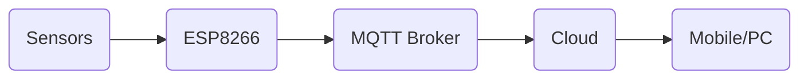

# AgroSense: Heart of Perfect Farming
This is a project in which we measure environmental values using IoT devices, store in cloud, analyse the data, compare with standard values and also take note of the existing data so that it can be used later. Furthermore, we use machine learning to predict any anomalous behaviour and also analyse the data. And hence we can give suggestions to farmers to improve their crop yield and also soil health.

## Problem We Are Solving
Taking an example of Agriculture as done in our project, the highest number of people involved in it requires proper monitoring due to a couple of reasons. The first one being the increasing population puts a higher demand on food, hence a higher efficiency/yield per unit area of land is required. Second being carelessness in usage of the land resource, farmers tend to over apply fertilizers and pesticides which seriously deteriorates the soil health, so a proper monitoring system can go a long way to conserve it.

This can be achieved by monitoring the parameters such as Temperature, Humidity, Soil Moisture, Rainfall, Sunlight, NPK Fertilizers etc. This data is then stored into the cloud which is compared with given standard values and provides suggestions to improve the soil quality. After which the yield can be also monitored so as to improve further in upcoming yields.

This project is a subset of our upcoming project which will be able to measure even more parameters and monitor the nutrient intake of the crops which can give a much better insight to the crop growth.

The app is designed in such a way that a farmer can easily access information in it in his mother tongue and would require minimum external help for understanding it.

Such a project can be modified to cover even more situations such as medical, home automation, security systems etc.

## Attached Pictures
- Cover image: Main hardware setup
- Picture 1: BME280 Temperature, Humidity, Pressure and BH1750 Light Sensor
- Picture 2: UV Index, Precipitation and location of node
- Picture 3: Proposed website to view data and suggestions
- Picture 4: Output of correlation between different sensors to draw useful conclusions

## Challenges We Faced
We had an issue using a cloud service AWS(Amazon Web Services) as the host for our website. It required time to get access to the cloud resources. Hence we had to use an existing cloud service called ThingSpeak to capture data from the ESP8266 and provide it in JSON format which is then fed into the website.

We had further problem in storage of data in a MongoDB database. So we had to resort to using real time data in the website for viewing purposes. So for the last part of the project we collected sensor data over a period of 5 hours in CSV format, saved it locally and analysed the data using Jupyter Notebook for testing purposes. Further we also ran a similar notebook for an existing database with the NPK fertilizer, Temperature, Humidity, pH, Rainfall columns and drew interesting conclusions such as, Rice needs heavy rainfall (>200 mm) and a humidity above 80% and hence grows well in East Coastal India where they get around 220mm of rainfall and Coconut is a tropical crop and needs high humidity and hence grows well in coastal areas around the country.

## Simplified Flowchart

## Final Results

